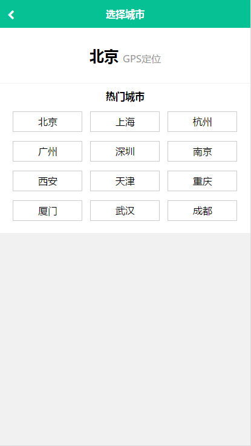
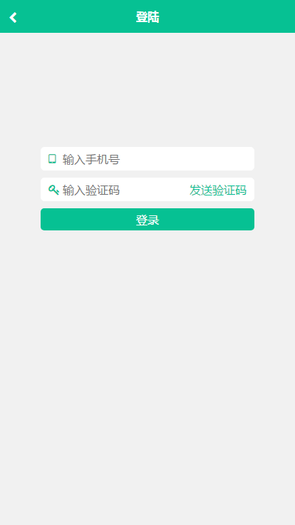

# 高仿美团网手机端SPA
## 技术栈
---
react + react-router + redux + webpack + less + ES6/7 + fetch
## 项目运行
---
#### 注意：由于使用ES6/7等新语法，node.js必须是6.0以上版本
```
git clone https://github.com/sheepmiee/react-meituan.git  

cd react-meituan

npm install

npm run mock

npm run dev
```
## 项目结构树
---
```
.
├─app                                        // 源码目录
|  ├─index.html                              // 入口html文件
|  ├─index.js                                // 打包入口文件
|  ├─util                                    // 工具方法
|  |  └localStore.js
|  ├─store							
|  |   └configureStore.js                    // redux的store仓库
|  ├─static                                  // 静态文件夹(字体及公共样式)
|  |   ├─fonts
|  |   |   ├─icomoon.eot
|  |   |   ├─icomoon.svg
|  |   |   ├─icomoon.ttf
|  |   |   └icomoon.woff
|  |   ├─css
|  |   |  ├─common.less
|  |   |  └font.css
|  ├─router                                  // react-router
|  |   └routerMap.js
|  ├─reducers                                // redux的reducer
|  |    ├─index.js
|  |    ├─store.js                           // 收藏reducer
|  |    └userinfo.js                         // 用户信息(username,cityName)reducer
|  ├─fetch                                   // 数据交互统一调配
|  |   ├─get.js
|  |   ├─post.js
|  |   ├─user
|  |   |  └orderlist.js                      // 用户评论数据请求方法
|  |   ├─search
|  |   |   └search.js                        // 搜索页数据请求方法
|  |   ├─home
|  |   |  └home.j                            // 首页数据请求方法
|  |   ├─detail						
|  |   |   └detail.js                        // 详情页数据请求方法
|  ├─containers                              // 6大页面组件配置(智能组件)
|  |     ├─404.js
|  |     ├─index.js                          // APP模块(6大页面的父组件)
|  |     ├─User
|  |     |  ├─index.js                       // 用户页
|  |     |  ├─subpage
|  |     |  |    └OrderList.jsx              // 订单列表
|  |     ├─Search
|  |     |   ├─index.jsx                     // 搜索页
|  |     |   ├─subpage
|  |     |   |    └List.jsx                  // 搜索列表
|  |     ├─Login
|  |     |   └index.jsx                      // 登录页
|  |     ├─Home
|  |     |  ├─index.js                       // 首页
|  |     |  ├─subpage
|  |     |  |    ├─Ad.js                     // 首页广告(超值特惠)
|  |     |  |    ├─List.js                   // 首页商户列表(猜你喜欢)
|  |     |  |    └style.less
|  |     ├─Detail
|  |     |   ├─index.js                      // 商户详情页
|  |     |   ├─subpage
|  |     |   |    ├─Buy.jsx                  // 购买与收藏
|  |     |   |    ├─Comment.jsx              // 评论列表
|  |     |   |    ├─Info.jsx                 // 商户详情
|  |     |   |    └style.less
|  |     ├─City
|  |     |  └index.jsx                       // 城市列表
|  ├─constants
|  |     ├─store.js                          // 收藏actions的type常量
|  |     └userinfo.js                        // 用户信息actions的type常量
|  ├─config
|  |   └localStoreKeys.js                    // 本地localStorage常量
|  ├─components                              // 木偶组件目录(展示数据的组件)
|  |     ├─UserInfo
|  |     |    ├─index.jsx                    // 用户信息组件
|  |     |    └style.less
|  |     ├─Star
|  |     |  ├─index.jsx                      // 星星评价公共组件
|  |     |  └style.less
|  |     ├─SearchInput
|  |     |      ├─index.jsx                  // 输入框公共组件
|  |     |      └style.less
|  |     ├─SearchHeader
|  |     |      ├─index.jsx                  // 搜索页头部组件
|  |     |      └style.less
|  |     ├─OrderList
|  |     |     ├─index.jsx                   // 订单列表组件
|  |     |     ├─style.less
|  |     |     ├─Item
|  |     |     |  └index.jsx
|  |     ├─LoginComponent
|  |     |       ├─index.jsx                 // 登录组件
|  |     |       └style.less
|  |     ├─LoadMore
|  |     |    ├─index.js                     //加载更多公共组件
|  |     |    └style.less
|  |     ├─ListComponent
|  |     |       ├─index.js                  // 列表公共组件
|  |     |       ├─style.less
|  |     |       ├─Item
|  |     |       |  ├─index.js
|  |     |       |  └style.less
|  |     ├─HomeHeader
|  |     |     ├─index.jsx                   // 首页头部组件
|  |     |     └style.less
|  |     ├─HomeAd
|  |     |   ├─index.js                      // 首页广告组件
|  |     |   └style.less
|  |     ├─Header
|  |     |   ├─index.js                      // 头部公共组件
|  |     |   └style.less
|  |     ├─DetailInfo
|  |     |     ├─index.jsx                   // 商户详情组件
|  |     |     └style.less
|  |     ├─CurrentCity
|  |     |      ├─index.jsx                  // 组件当前城市组件
|  |     |      └style.less
|  |     ├─CommentList
|  |     |      ├─index.jsx                  // 评论列表组件组件
|  |     |      ├─style.less
|  |     |      ├─Item
|  |     |      |  ├─index.jsx
|  |     |      |  └style.less
|  |     ├─CityList
|  |     |    ├─index.jsx                    // 城市列表组件
|  |     |    └style.less
|  |     ├─Category
|  |     |    ├─index.js	             // 分类(轮播图)组件
|  |     |    └style.less
|  |     ├─BuyAndStore
|  |     |      ├─index.jsx                  // 收藏购买组件
|  |     |      └style.less
|  ├─actions
|  |    ├─store.js                           // 配置收藏action
|       └userinfo.js                         // 配置用户信息action
├─screenshots                                // 截图
├─mock
|  ├─README.md
|  ├─server.js                               // 数据模拟服务
|  ├─search
|  |   └list.js                              // 数据搜索页列表数据
|  ├─orderlist
|  |     └orderList.js                       // 用户页订单列表数据
|  ├─home
|  |  ├─ad.js                                // 首页广告数据
|  |  └list.js                               // 首页上海列表数据
|  ├─detail
|  |   ├─comment.js                          // 详情页评论数据
|      └info.js                              // 详情页商户详情数据
├─.babelrc                                   // babel解析配置文件
├─.eslintrc                                  // 代码规范配置
├─package.json						
├─README.md
├─webpack.config.js                          // webpack开发配置文件
├─webpack.production.config.js               // webpack上线配置文件

```
## 页面截图展示(按照开发流程顺序)
### 首页页--城市页
 
### 搜索页--商户详情页
 
### 登录页--用户页
 

## 部分功能动态展示
### 首页加载与城市变更--搜索页加载
 
#### 收藏与登陆--用户评价
 

## 说明
---
> 写了一些这个项目的一些总结与感悟，较为杂乱[点这里](./notes.md)

> react的学习之路是艰辛的，像升级打怪一样走过来了，回过头却发现，也就那么回事（此处请允许我装B一分钟，前方的路其实还很远。。）

> 这里推荐一个react项目，其实主要是推荐一下这位兄台的react的个人感悟，对于react初学很有帮助
[地址在这里](https://github.com/bailicangdu/react-pxq?_blank)